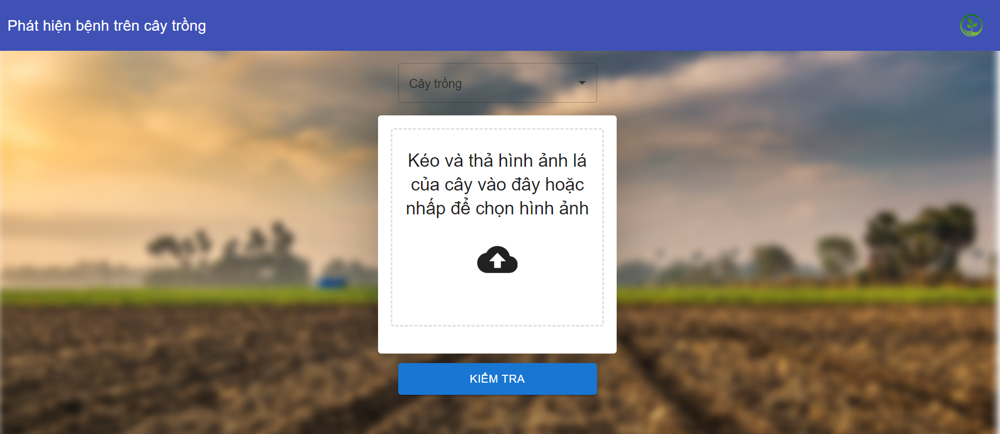

<h1 align="center">🌱 Plant Disease Classification</h1>
<div align="center">
    
</div>

---

## 📌 Introduction

This project leverages the power of **EfficientNet**, a state-of-the-art deep learning model, to **help farmers and gardeners quickly and accurately identify plant diseases** using images of plant leaves. Upon detecting a disease, the application provides **detailed information**, including the disease's **name, cause, and symptoms**.

---

## ⚡ EfficientNet: Why It Matters for Plant Disease Detection

[EfficientNet](https://arxiv.org/abs/1905.11946) is a **convolutional neural network (CNN)** designed to balance **accuracy and efficiency**. Unlike traditional models that scale only in width, depth, or resolution, **EfficientNet** scales all three dimensions **simultaneously**, leading to **better performance with fewer computations**.

### 🏆 **Why EfficientNet for Plant Disease Classification?**
✅ **Higher Accuracy** – Outperforms ResNet, MobileNet, and Inception models.  
✅ **Fewer Parameters** – Uses **5x fewer parameters** than ResNet-50 while achieving higher accuracy.  
✅ **Optimized for Mobile & Edge AI** – Enables deployment on **smartphones, drones, and Raspberry Pi**.  
✅ **Faster Inference** – Runs efficiently in **real-time agricultural applications**.

### 🔬 **EfficientNet vs. Traditional Models**
| Model | Parameters | Accuracy (ImageNet) | FLOPs (B) |
|--------|-----------|---------------------|-----------|
| ResNet-50 | 25.6M | 76.6% | 4.1 |
| MobileNetV2 | 3.4M | 72.0% | 0.3 |
| EfficientNet-B0 | 5.3M | 77.1% | 0.4 |
| EfficientNet-B7 | 66M | 84.4% | 37.0 |

📊 **Key Takeaways:**
- **EfficientNet-B0** achieves similar accuracy to **ResNet-50** but with **5x fewer parameters**.  
- **EfficientNet-B7** outperforms most CNN architectures with **84.4% top-1 accuracy**.  
- **Lower FLOPs (floating-point operations)** mean **faster inference** on low-power devices.  

### 📜 **EfficientNet Architecture**
<div align="center">
    
</div>

EfficientNet scales a model in **three dimensions**:  
1️⃣ **Depth** – More layers for complex pattern recognition.  
2️⃣ **Width** – Wider layers to retain fine-grained details.  
3️⃣ **Resolution** – Larger input size to detect subtle disease features.  

By combining these factors, EfficientNet achieves **higher accuracy while using fewer resources**.

### 🌍 **Real-World Applications**
🚜 **Smartphone Apps** – Farmers can use mobile apps to detect diseases instantly.  
🌱 **IoT & Edge AI** – EfficientNet models can run on **Raspberry Pi & Jetson Nano**.  
☁️ **Cloud-Based APIs** – Agricultural platforms can integrate real-time plant disease detection.  
📡 **Drone & Smart Camera Systems** – Automate plant health monitoring in large-scale farms.  

📄 **Reference Paper:**  
🔗 Mingxing Tan, Quoc V. Le. **EfficientNet: Rethinking Model Scaling for Convolutional Neural Networks**  
📖 [Read on arXiv](https://arxiv.org/abs/1905.11946)

---

## 🏗️ Project Overview

This project consists of **three main components**:

1️⃣ **Training Pipeline** – Train multiple models on the plant disease dataset.  
2️⃣ **Server** – Build a **FastAPI server** to serve predictions.  
3️⃣ **Client** – Create a **React-based web application** for user interaction.  

---

## 📂 Dataset

The dataset is collected from various Kaggle sources and includes **22 plant types** with multiple **disease classes**.

### 🔹 **Data Overview**
- 🌿 **22 plant types**
- 🔬 **Multiple diseases per plant**
- 🖼️ **Dataset split**: `Train`, `Validation`, and `Test`

| 🌱 Plant Type  | 🦠 Disease Classes |
|---------------|------------------|
| Apple        | 4 (e.g., brown spot, gray spot) |
| Bell Pepper  | 2 (e.g., bacterial spot, healthy) |
| Potato       | 3 (e.g., early blight, late blight, healthy) |
| Tomato       | 8 (e.g., bacterial spot, leaf mold, late blight) |
| ...         | ... |

📥 **Download Dataset:**  [Kaggle Dataset Link](https://www.kaggle.com/datasets/nguyenchitinh/plantdisease-with-20-plant)

---

## ⚙️ Set-up

### 1️⃣ Clone the Repository
```bash
git clone git@github.com:tinh2044/PlantDisease_classification.git
cd PlantDisease_classification
```

### 2️⃣ Create a Virtual Environment (Python 3.9 Recommended)
```bash
conda create --name plantDisease python=3.9
conda activate plantDisease
```

### 3️⃣ Install Dependencies
```bash
pip install -r requirements.txt
```

---

## 🏋️‍♂️ Training the Model

### 📥 **Download Dataset**
Download the dataset manually:  [Kaggle Dataset](https://www.kaggle.com/datasets/nguyenchitinh/plantdisease-with-20-plant)

Or use **Kaggle CLI**:
```bash
kaggle datasets download -d nguyenchitinh/plantdisease-with-20-plant
```

### 🚀 **Train the Model**
```bash
python train_multiple_model.py --epoch 100 --batch_size 32 --root_dir ./Datasets --img_size 224 --export_dir ./SavedModels --h5_dir ./Models
```
💾 **After training**, model weights will be saved in:
- `./Models/` → Trained `.h5` model weights.
- `./SavedModels/` → TensorFlow SavedModel format.

### 📊 **Evaluate the Model**
```bash
python evaluate.py --root_dir ./Datasets --h5_dir ./Models
```

### 🔄 **Convert Model to TFLite**
```bash
python convert_tflite.py
```

---

## 🌐 Server

Ensure that **all TFLite models** are copied to:
```
server/ModelLight/
```

### ▶️ **Run the Server**
```bash
cd server
uvicorn app.main:app --host 127.0.0.1 --port 5000
```
✅ **API will be accessible at:** `http://127.0.0.1:5000`

### 🐳 **Run with Docker**
```bash
docker compose up
```

---

## 🖥️ Client

Move to the client directory:
```bash
cd client
```

### ▶️ **Run the Client**
```bash
npm start
```

### 🔧 **Configure Environment Variables**
Create a `.env` file in the `client/` folder and add:
```ini
REACT_APP_API_URL=http://127.0.0.1:5000
```

---

## 📚 References

- 📂 [New Plant Diseases Dataset](https://www.kaggle.com/datasets/vipoooool/new-plant-diseases-dataset)
- 🔬 [Plant Disease Classification Merged Dataset](https://www.kaggle.com/datasets/alinedobrovsky/plant-disease-classification-merged-dataset)
- 📜 [EfficientNet: Rethinking Model Scaling](https://arxiv.org/abs/1905.11946)
- 🏋️ [Transfer Learning with TensorFlow](https://www.tensorflow.org/tutorials/images/transfer_learning)
